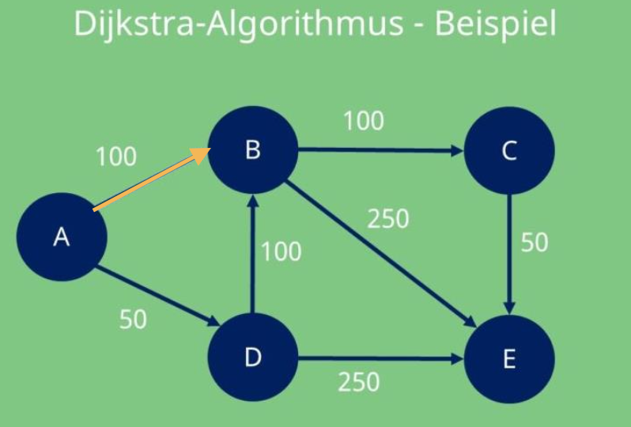

# Aufnahmeprüfung Informatik

<!-- @import "[TOC]" {cmd="toc" depthFrom=1 depthTo=6 orderedList=false} -->

<!-- code_chunk_output -->

- [Aufnahmeprüfung Informatik](#aufnahmeprüfung-informatik)
  - [Einführung](#einführung)

<!-- /code_chunk_output -->

## Einführung



**Sortieralgorithmen** 101 okay

- Sortieralgorithmen
  - Selectionsort
  - quicksort
    - pivot-element
  - bubblesort

```c++
#include <iostream>


int add(int a, int b)
{
    return a + b;
}


int main()
{
    std::cout << "Hello World!" << std::endl;
    int a = 5;
    int b = 6;
    std::cout << "a + b = " << add(a, b) << std::endl;
    return 0;
}
```
